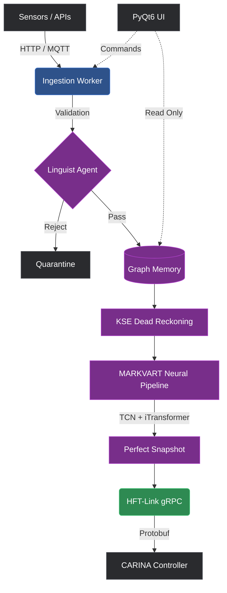

# SYNAPSE CORE
> **A Gateway of Intelligent Perception for Traffic Management**

[](https://www.gnu.org/licenses/agpl-3.0)
[]()
[]()
[]()
[]()
[]()

---

## 📖 Executive Summary

**SYNAPSE** is an enterprise-grade, real-time AI traffic perception platform developed by **Noxfort Systems**. It operates as the "Brain" of a modern Smart City architecture. SYNAPSE ingests highly heterogeneous and asynchronous data from urban sensors (cameras, radar, induction loops) and global APIs (Waze, TomTom). 

Using an ensemble of 11 distinct neural networks (MARKVART™), it constructs a mathematically sound, physics-validated state of the entire urban grid. This state is then transported via a low-latency gRPC tunnel (HFT-Link) to the traffic controller engine, **CARINA**, to execute macroscopic fluid-dynamic traffic light optimization.

---

## 🏗️ System Architecture

SYNAPSE is built using a strict **Model-View-Controller (MVC)** pattern enforced by **SOLID** principles, allowing a pure PyTorch Backend to interact safely with a PyQt6 Frontend without blocking the real-time inference loop.



---

## 🧠 Neural Architecture Stack (MARKVART™)

The **Modular Adaptive Reasoning Kernel with Variational Attention & Recurrent Transformers** deploys 11 models across 3 semantic levels. 

For full mathematical and architectural details on the models, refer to the [Neural Models Documentation](docs/03_neural_models.md).

| Model | Subsystem | Responsibility |
|-------|----------|---------------|
| **TCN** | Specialist | Local feature extraction. Resolves long-range dependencies using dilated causal convolutions. |
| **VAE-TCN** | Corrector | Generative noise filtering. Reconstructs missing local patterns. |
| **NeuroSymbolic** | Linguist | Zero-trust ingestion gatekeeper using a frozen DistilRoBERTa. |
| **GATv2 Lite** | Coordinator | Regional spatial reasoning over the city graph topology. |
| **SinkhornCrossAttention** | Cartographer| Matches ambiguous GPS traces to strict map edges. |
| **iTransformer** | Fuser | Global inference. Inverts time-tokens to sensor-tokens to fuse the "Perfect Snapshot". |
| **TimesNet** | Translation | Discovers periodic macro-patterns (e.g. morning rush) via FFT. |
| **TimeGAN** | Imputer | Fills massive multi-hour data gaps safely. |
| **WaveletAE-OCC**| Auditor | Anomaly detection via frequency translation-invariant classifiers. |
| **DistilRoBERTa + GMM**| PeakClassifier| Automates traffic period segmentation for the historical Golden Dataset. |
| **Qwen3 1.7B** | Jurist | Generates human-readable, legal-grade audit reports for automated decisions. |

---

## ⏱️ Execution Phases (ADAGIO™)

**Automated Data Analysis, Generation & Inference Orchestration.**

1. **Phase 0 (Optimization)**: Optuna-driven AutoML calibration.
2. **Phase 1 (Offline Bootstrap)**: Generates the historical "Golden Dataset" baseline from `.parquet` files and establishes Ghost-file protection.
3. **Phase 2 (Online Runtime)**: Starts the 4-Thread Concurrency Model (Ingestion, Standby, XAI Ephemeral, and Neural Core threads).

See [Execution Phases](docs/04_execution_phases.md) for in-depth technical flows.

---

## ⚡ HFT-Link & Auto-Recovery

SYNAPSE guarantees uninterrupted traffic control data flow via the **High-Frequency Transport Link**:
- **Protocol**: gRPC over HTTP/2 using Protobuf.
- **Resilience**: Configured for large payload transmission (50MB Limit) for full-city graphs.
- **Auto-Recovery**: Caches binary maps in memory. If the downstream server (CARINA) restarts or drops packets, SYNAPSE loops in a non-blocking background thread, transparently re-uploading the network map and re-arming the stream the millisecond the connection restores.

See [Data Ingestion & HFT](docs/05_data_ingestion_and_hft.md) for the internal connection loops.

---

## 🖥️ UI/UX Experience

The application features a fully decoupled **PyQt6** frontend:
- **ThemeManager**: Dynamic dark/light modes.
- **TranslationManager**: Full i18n support.
- **SignalRouter**: Thread-safe asynchronous UI updates via Qt Signals, ensuring the main neural thread never blocks for a screen paint.
- **System Tray Integration**: Background headless operation with rapid foreground surfacing.

See [UI Architecture](docs/02_ui_architecture.md) for the exact class delegations and GUI design patterns.

---

## 🛠 Installation & Setup

### Minimum Hardware Requirements
- **CPU**: 8+ Cores (Required for multi-threaded KSE and Graph manipulation).
- **RAM**: 16 GB minimum.
- **GPU**: NVIDIA GPU with CUDA 12.x and at least **8GB VRAM** (Required to host Qwen3 1.7B and the PyTorch models concurrently).
- **OS**: Ubuntu 22.04 LTS or newer.

### Installation

1. **Clone the repository:**
   ```bash
   git clone https://github.com/noxfort/SYNAPSE_CORE.git
   cd SYNAPSE_CORE
   ```

2. **Create a virtual environment & install dependencies:**
   ```bash
   python3 -m venv .venv
   source .venv/bin/activate
   pip install -r requirements.txt
   ```

3. **Install Pre-trained Models:**
   See the `Model Vault` section below.

4. **Launch the platform:**
   ```bash
   python synapse.py
   ```

---

## 📦 Pre-trained Models (Model Vault)

Due to Git file size limits, the pre-trained neural network tensors and PyTorch files are not included in this repository. 
To run SYNAPSE, you must download the foundational models separately.

**Download the primary Language Model here:**
- [HuggingFace Hub (Qwen3-1.7B)](https://huggingface.co/Qwen/Qwen3-1.7B)

**Installation:**
After downloading the model files, place them inside the root directory under the `Model Vault/` folder matching the correct path:
`SYNAPSE_CORE/Model Vault/qwen3_1.7B/`

---

## 📚 Exhaustive Documentation

For deep technical details, we have mapped out the entire domain, UI, and neural mathematical basis in the `docs/` directory:

1. [Domain Entities & Core Structures](docs/01_domain_entities.md)
2. [UI Architecture & Frontend](docs/02_ui_architecture.md)
3. [Neural Models & PyTorch Implementations](docs/03_neural_models.md)
4. [Execution Phases & Lifecycle](docs/04_execution_phases.md)
5. [Data Ingestion & HFT Network](docs/05_data_ingestion_and_hft.md)
6. [Developer Guide (Protobuf & Testing)](docs/06_developer_guide.md)
7. [Production Deployment Guide](docs/07_deployment_guide.md)

---

## 🤝 Governance & Community

SYNAPSE is an Enterprise-grade Open Source project. We welcome community contributions! 
Before contributing, please review our community health files:
- [Contributing Guidelines](CONTRIBUTING.md)
- [Code of Conduct](CODE_OF_CONDUCT.md)
- [Security Policy](SECURITY.md) (For reporting Zero-Trust/Data vulnerabilities)
- [Changelog](CHANGELOG.md)

---

## 📄 License

This project is licensed under the **GNU Affero General Public License v3.0 (AGPL-3.0)** — see the [LICENSE](LICENSE) file for details.

---

<p align="center">
  <sub>Built with ❤️ by <strong>Noxfort Systems</strong></sub>
</p>