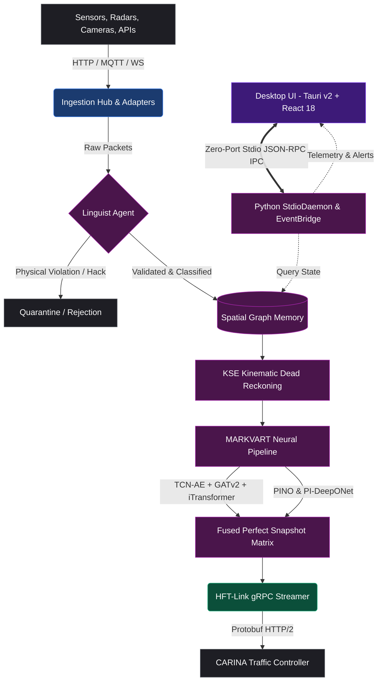

# SYNAPSE CORE
> **An Intelligent Perception & Neural Fusion Gateway for Smart City Traffic Management**

[](https://www.gnu.org/licenses/agpl-3.0)
[]()
[]()
[]()
[]()
[-blueviolet)]()
[]()
[]()

---

## 📖 Executive Summary

**SYNAPSE CORE** is an enterprise-grade, real-time AI perception and neural fusion platform developed by **Noxfort Systems**. It serves as the primary sensory and cognitive gateway for modern Smart City architectures. 

SYNAPSE continuously ingests massive, heterogeneous, asynchronous data streams from municipal sensors (cameras, radar, induction loops, Bluetooth/BLE beacons) and external cloud APIs (Waze, TomTom, OpenStreetMap, SUMO traffic networks). 

Using **MARKVART™** (a modular ensemble of 11 deep neural architectures and physics-informed operators), SYNAPSE reconstructs a mathematically sound, fluid-dynamically validated state of the entire urban traffic grid. This synthesized snapshot is transmitted via **HFT-Link** (an ultra-low-latency gRPC stream) to downstream traffic light controllers such as **CARINA** for macroscopic phase and green-wave optimization.

```
                  ┌────────────────────────────────────────────────────────┐
                  │                 SYNAPSE CORE v2.0                      │
                  │  ┌──────────────┐   Zero-Port    ┌──────────────────┐  │
                  │  │  Tauri v2 UI │ ◄────────────► │   Stdio Daemon   │  │
                  │  │  (React 18)  │    JSON-RPC    │  (Python Core)   │  │
                  │  └──────────────┘                └────────┬─────────┘  │
                  └───────────────────────────────────────────┼────────────┘
                                                              │
   ┌──────────────────────┐      ┌─────────────────────────┐  │  ┌──────────────────────┐
   │ Heterogeneous Inputs │ ───► │  Zero-Trust Gatekeeper  │ ─┴─►│ MARKVART™ Neural Stack│
   │ Cameras, Radars,     │      │  (NeuroSymbolic Distil) │     │ (PINO, DeepONet, iTrans)
   │ Loops, Waze, TomTom  │      └─────────────────────────┘     └──────────┬───────────┘
   └──────────────────────┘                                                 │
                                                                 ┌──────────▼───────────┐
                                                                 │ HFT-Link gRPC Stream │
                                                                 │ (< 250ms latency)    │
                                                                 └──────────┬───────────┘
                                                                            │
                                                                 ┌──────────▼───────────┐
                                                                 │  CARINA Controller   │
                                                                 └──────────────────────┘
```

---

## 🏗️ System Architecture

SYNAPSE adheres strictly to **Domain-Driven Design (DDD)**, **Clean Architecture**, and **SOLID** principles, ensuring full decoupling between ingestion, neural inference, background daemon orchestration, and the high-performance desktop interface:



---

## 🧠 Neural Architecture Stack (MARKVART™)

The **Modular Adaptive Reasoning Kernel with Variational Attention & Recurrent Transformers (MARKVART™)** deploys 11 specialized neural networks across three semantic levels:

| Model | Subsystem / Agent | Mathematical Formulation / Paradigm | Primary Responsibility |
| :--- | :--- | :--- | :--- |
| **PINO-Traffic** | Continuum Operator | Fourier Neural Operator (FNO) + Lighthill-Whitham-Richards (LWR) PDE Constraints | Physics-informed macroscopic traffic flow simulation and shockwave modeling across road networks. |
| **PI-DeepONet** | Continuous Estimator | Physics-Informed Deep Operator Network with dual Branch/Trunk architectures | Solves infinite-dimensional continuous velocity and density fields over variable spatio-temporal domains. |
| **PI-VAE-TCN** | Corrector Agent | Variational Autoencoder with Dilated Causal Convolutions & Kinetic Loss | Filters sensor noise and reconstructs missing local temporal trajectories with physical conservation guarantees. |
| **iTransformer** | Fuser Agent | Inverted Multi-Variate Transformer with Spatio-Temporal Cross-Attention | Global temporal fusion treating variates as tokens, cross-attending with spatial graph embeddings. |
| **GATv2 Lite / Diffusion**| Coordinator Agent | Dynamic Graph Attention Networks v2 with Spatial Diffusion Kernel | Captures non-Euclidean spatial relationships, congestion propagation, and arterial bottlenecks across city topology. |
| **Sinkhorn Cross-Attention**| Cartographer Agent | Entropic Optimal Transport (Sinkhorn Algorithm) + Cross-Attention | Performs fast, differentiable map-matching, aligning noisy GPS probe traces to exact street graph edges. |
| **TimesNet** | Translation Agent | 2D Fourier Transformation (FFT) + Multi-Period Inception Blocks | Deconstructs multi-frequency periodic patterns (e.g., morning rush, weekend dips, school holidays). |
| **TimeGAN** | Imputer Agent | Generative Adversarial Network with Temporal Autoencoder Latents | Imputes prolonged data outages and gaps (> 2 hours) preserving realistic auto-correlation distributions. |
| **WaveletAE-OCC** | Auditor Agent | Discrete Wavelet Transform Autoencoder + Deep One-Class Classification | High-frequency frequency-domain anomaly detection, identifying faulty sensors, hacks, or unusual grid disruptions. |
| **DistilRoBERTa + GMM** | Peak Classifier & Linguist | Transformer Language Model + Gaussian Mixture Models | Zero-trust semantic validation of incoming sensor schemas and unsupervised clustering of urban peak traffic schedules. |
| **Qwen3 (1.7B / 2B)** | Jurist Agent | Quantized LLM (GGUF / SafeTensors) + Jinja2 Localization Templates | Generates legal-grade, explainable AI (XAI) audit reports and natural language justifications for automated signal actions. |

For full mathematical derivations, equations, and loss formulations, refer to the [Neural Models Documentation](docs/03_neural_models.md).

---

## ⏱️ Execution Phases (ADAGIO™)

SYNAPSE operates through a structured execution pipeline called **ADAGIO™** (*Automated Data Analysis, Generation & Inference Orchestration*):

1. **Phase 0 — Optimization & Calibration (`OptimizationPhase`)**:
   - Executes automated hyperparameter tuning via **Optuna** and **Population-Based Training (PBT)**.
   - Calibrates baseline sensor variance, latent dimensions, and anomaly detection thresholds.
2. **Phase 1 — Offline Bootstrap (`BootstrapPhase`)**:
   - Generates historical *Golden Datasets* from partitioned `.parquet` files.
   - Computes **MEH** (*Micro-Estimation History*) matrices and enforces *Ghost-File* memory protections.
3. **Phase 2 — Online Runtime (`RuntimePhase`)**:
   - Launches the **4-Thread Real-Time Concurrency Architecture**:
     - 📥 **Ingestion Worker Thread**: Asynchronously consumes HTTP, MQTT, and WebSocket sensor payloads.
     - 🛡️ **Standby Linguist Thread**: Zero-trust validation and schema sanitization of quarantined data.
     - 🧠 **Neural Core Inference Thread**: High-throughput GPU execution of MARKVART™ and KSE dead reckoning.
     - ⚖️ **XAI Jurist Worker Thread**: Non-blocking asynchronous generation of natural language audit logs.

For detailed sequence diagrams, see [Execution Phases](docs/04_execution_phases.md).

---

## ⚡ HFT-Link & Resilient Self-Healing

SYNAPSE guarantees uninterrupted traffic control data transmission via the **High-Frequency Transport Link (HFT-Link)**:

- **Protocol**: High-speed gRPC over HTTP/2 with binary Protocol Buffers (`proto/synapse_hft.proto`).
- **Payload Capacity**: Configured with a 50MB maximum message limit to support whole-metropolis topological graphs and high-density telemetry in a single frame.
- **Latency Guarantee**: End-to-end cycle delivery in $< 250\text{ ms}$.
- **Zero-Downtime Auto-Recovery**: If the downstream controller (CARINA) restarts or drops network packets, SYNAPSE caches binary maps in memory and loops in a non-blocking background thread (`hft_recovery.py`), transparently re-uploading the network scenario and re-arming the streaming pipeline the millisecond the connection restores.

---

## 🖥️ Modern Desktop Interface (Tauri v2 + React 18)

The frontend is a dedicated, native desktop application engineered with **Tauri v2** and **React 18**:

- **Zero-Port IPC Security**: Frontend communicates with the Python core exclusively through standard streams (`stdin`/`stdout`) via the `StdioDaemon` JSON-RPC protocol, eliminating local network port vulnerabilities.
- **Dynamic Theming**: Full Dark/Light theme switching powered by Tailwind CSS.
- **Multi-Language Localization**: Full i18n support in English (`en`), Portuguese (`pt_BR`), Spanish (`es`), French (`fr`), Chinese (`zh`), and Russian (`ru`).
- **High-Rate Telemetry**: Hardware-accelerated Echarts render live queue lengths, occupancy graphs, and sensor confidence metrics.
- **Decoupled Event Bridge**: The core PyTorch inference cycle is completely isolated from GUI rendering threads.

---

## 🛠️ Installation & Setup

### Hardware Requirements

| Component | Minimum Specification | Recommended Specification |
| :--- | :--- | :--- |
| **CPU** | 8 Cores (x86_64) | 16+ Cores (AMD Ryzen 9 / Intel i9 / Xeon) |
| **RAM** | 16 GB | 32 GB DDR4/DDR5 |
| **GPU** | NVIDIA GPU with 8 GB VRAM (CUDA 12.x) | NVIDIA RTX 3090 / 4090 / A5000 (16+ GB VRAM) |
| **Storage** | 20 GB free NVMe SSD | 100 GB+ NVMe SSD (for large historical Parquet files) |
| **OS** | Ubuntu 22.04 LTS (Jammy) | Ubuntu 22.04 / 24.04 LTS |

---

### Step-by-Step Installation

#### 1. Clone the Repository
```bash
git clone https://github.com/noxfort/SYNAPSE_CORE.git
cd SYNAPSE_CORE
```

#### 2. Configure Python Virtual Environment
```bash
python3 -m venv .venv
source .venv/bin/activate
pip install --upgrade pip
pip install -r requirements.txt
```

#### 3. (Optional) Install Frontend Dependencies (For Desktop UI Development)
If you wish to build or develop the Tauri v2 desktop application:
```bash
# Ensure Rust and Node.js are installed
curl --proto '=https' --tlsv1.2 -sSf https://sh.rustup.rs | sh -s -- -y
source "$HOME/.cargo/env"

# Install UI npm packages
cd ui
npm install
cd ..
```

#### 4. Configure Pre-Trained Weights (Model Vault)
SYNAPSE relies on foundational language and transformer weights stored in `Model_Vault/`.
- Ensure `Model_Vault/distilroberta/` contains `model.safetensors`, `config.json`, `tokenizer.json`, etc.
- Ensure `Model_Vault/Qwen3.5-2B-UD-Q6_K_XL.gguf` (or `Model_Vault/qwen3_1.7B/`) is present.
- For detailed instructions, refer to [`Model_Vault/README.md`](Model_Vault/README.md).

---

## 🚀 Running SYNAPSE

### 1. Launch Modern Desktop Interface
```bash
# Automatically detects Rust/Tauri or falls back to headless mode
python synapse.py
```

### 2. Launch in Headless Daemon Mode (Servers & Production)
For containerized cloud deployments or background edge servers without graphical displays:
```bash
# Run headless IPC daemon
python synapse.py --daemon
# OR
python synapse.py --headless
# OR
SYNAPSE_HEADLESS=1 python synapse.py
```

### 3. Run Observability Stack (Prometheus + Grafana + TensorBoard)
```bash
docker compose -f observability/docker-compose.yml up -d
```
- **Grafana**: [http://localhost:3000](http://localhost:3000) (User: `admin` | Password: `synapse123`)
- **Prometheus**: [http://localhost:9090](http://localhost:9090)
- **TensorBoard**: [http://localhost:6006](http://localhost:6006)

---

## 🧪 Testing & Validation

SYNAPSE includes a comprehensive test suite of 70+ test suites covering unit logic, integration pipelines, and hardware stress benchmarks:

```bash
# Run all unit and integration tests
pytest tests/ -v

# Run with coverage report
pytest --cov=src tests/

# Run sensor stress benchmark (simulate 100 sensors under full load)
python tests/benchmark.py
```

For complete details on testing mocks and fixtures, see [`tests/README.md`](tests/README.md).

---

## 📂 Repository Directory Map

```text
SYNAPSE_CORE/
├── Model_Vault/              # Foundation neural weights (SafeTensors, GGUF, tokenizers)
├── docs/                     # Technical documentation library (01 to 07)
├── observability/            # Prometheus, Grafana, TensorBoard docker orchestration
├── packaging/                # Native Debian (.deb) builder & Dockerfile
├── proto/                    # Protobuf schemas for HFT-Link gRPC
├── src/                      # Python Core Backend (Clean Architecture / DDD)
│   ├── adapters/             # Ingestion adapters (HTTP push/poll, MQTT, WS, Replay)
│   ├── afb/                  # Adaptive Fallback Engine & SensorGuard
│   ├── agents/               # Autonomous MARKVART™ agents (Specialist, Fuser, Jurist, etc.)
│   ├── blocks/               # Neural building blocks (Graph, Spectral, Temporal)
│   ├── controllers/          # Business logic controllers (System, Project, View)
│   ├── domain/               # Core entities, repositories, and AppState facade
│   ├── engine/               # Real-time inference engine, cycle runner, and routers
│   ├── factories/            # Factory patterns for agents, models, nodes, phases
│   ├── fenix/                # Self-healing, drift evaluation, and maintenance
│   ├── handlers/             # Command and database handlers
│   ├── infrastructure/       # gRPC client, Postgres manager, SafeTensors storage
│   ├── interfaces/           # Formal typing contracts and Abstract Base Classes (ABCs)
│   ├── ipc/                  # StdioDaemon, JSON-RPC protocol, and EventBridge
│   ├── kse/                  # Kinematic State Estimation (Kalman Dead Reckoning)
│   ├── logging/              # Interceptor-based logging and log facades
│   ├── managers/             # Graph, Node, Storage, Source, and XAI managers
│   ├── meh/                  # Micro-Estimation History & Golden Dataset loader
│   ├── memory/               # Episodic, Semantic, Spatial, Spatiotemporal memory
│   ├── models/               # PyTorch models (PINO, DeepONet, iTransformer, GATv2)
│   ├── optimization/         # Optuna AutoML and Population-Based Training (PBT)
│   ├── phases/               # ADAGIO™ execution phases (0, 1, 2)
│   ├── physics/              # LWR continuum physics, fundamental diagrams, physical losses
│   ├── pipeline/             # Agent orchestration pipelines (Fusion, Specialist, etc.)
│   ├── services/             # Domain and infrastructure services
│   ├── strategies/           # Validation, imputation, and clustering strategies
│   └── utils/                # Hardware acceleration, geometry, normalization helpers
├── tests/                    # PyTest test suites, mocks, and stress benchmarks
├── ui/                       # Modern Desktop Frontend (Tauri v2 + React 18 + Vite)
│   ├── src-tauri/            # Rust native backend & sidecar manager
│   └── src_ui/               # React 18 components, Zustand stores, Echarts, Tailwind
├── synapse.py                # Main application launcher
└── synapse.spec              # PyInstaller binary packaging specification
```

---

## 📚 Exhaustive Documentation Library

For granular mathematical, architectural, and operational manuals, explore the `docs/` library:

1. [Domain Entities & Core Structures](docs/01_domain_entities.md)
2. [UI Architecture & Frontend](docs/02_ui_architecture.md)
3. [Neural Models & PyTorch Implementations](docs/03_neural_models.md)
4. [Execution Phases & Lifecycle](docs/04_execution_phases.md)
5. [Data Ingestion & HFT Network](docs/05_data_ingestion_and_hft.md)
6. [Developer Guide (Protobuf & Testing)](docs/06_developer_guide.md)
7. [Production Deployment Guide](docs/07_deployment_guide.md)

---

## 🤝 Community & Governance

SYNAPSE CORE is an enterprise open-source project. We welcome contributions and peer review:
- [Contributing Guidelines](CONTRIBUTING.md)
- [Code of Conduct](CODE_OF_CONDUCT.md)
- [Security Policy](SECURITY.md)
- [Changelog](CHANGELOG.md)

---

## 📄 License

This software is licensed under the **GNU Affero General Public License v3.0 (AGPL-3.0)** — see the [LICENSE](LICENSE) file for complete details.

---

<p align="center">
  <sub>Built with precision by <strong>Noxfort Systems</strong></sub>
</p>